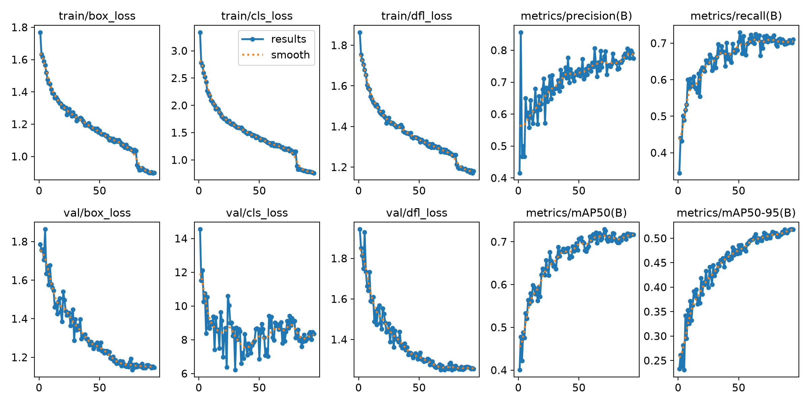

# SonarSense — AI-Powered Underwater Marine Debris Detection



*Training curves of the YOLOv8 detector (`backend/best.pt`) over ~95 epochs: training/validation losses (box, class, DFL), plus precision, recall, mAP@50 and mAP@50-95 on the validation split.*

SonarSense (Smart India Hackathon problem **SIH26057**) detects, measures and geolocates underwater marine debris in **side-scan sonar** imagery. A FastAPI backend runs an acoustic preprocessing pipeline based on real sonar physics, then a YOLOv8 detector. A Next.js tactical dashboard shows the sonar waterfall, the detections on a map, 3D size estimates for each target, and a PDF clearance report you can export.

---

## Model performance

Approximate final validation values, read from the training curves above:

| Metric | Value |
|---|---|
| Precision | ~0.78 |
| Recall | ~0.71 |
| **F1 Score** | **~0.74** |
| mAP@50 | ~0.72 |
| mAP@50-95 | ~0.52 |

**F1 Score of ~0.74 (74%)** — this is the harmonic mean of precision and recall, meaning the model strikes a strong and balanced trade-off between avoiding false alarms (precision 78%) and not missing real targets (recall 71%). A score above 0.70 is considered strong for multi-class sonar object detection, where targets vary widely in size and acoustic signature.

The trained weights (`backend/best.pt`) detect 4 classes:

| ID | Class |
|---|---|
| 0 | `ghost_net` |
| 1 | `shipwreck` |
| 2 | `mine_cylinder` |
| 3 | `submarine_pipeline` |

Training loss drops steadily over the whole run, and there is a visible step near epoch 80, where YOLOv8 turns off mosaic augmentation. Validation box and DFL loss flatten out after about epoch 60. Validation classification loss stays noisy because the dataset is small.

---

## Features

- **7-stage sonar pipeline:** Raw → TVG → SRAD → Lee filter → slant-range correction → YOLOv8 detection → 3D MVB mensuration. You can view each stage on its own in the UI.
- **Real YOLOv8 inference** on sonar images you upload, with CLAHE contrast enhancement and a confidence threshold of 0.25.
- **Highlight-shadow physics:** each target's height is estimated from the length of its acoustic shadow, using the towfish geometry (similar triangles).
- **3D Minimum Volumetric Bounding (MVB):** length, width, height, orientation, volume (m³), seabed footprint (m²) and an 8-corner wireframe for each target.
- **Georeferencing:** pixel detections are converted to WGS84 lat/lon and returned as an RFC 7946 GeoJSON `FeatureCollection`.
- **Threat taxonomy:** a 13-class debris/hazard taxonomy (ghost nets, UXO, sea mines, chemical drums, containers, wrecks, …), each class rated HIGH, MEDIUM, LOW or UNKNOWN.
- **Tactical dashboard:** sonar waterfall viewer, Mapbox subsea tactical map, physics formula inspector, 3D MVB viewer, and a simulated live AUV scan.
- **Exports:** a PDF clearance dossier (jsPDF), a CSV report and GeoJSON.

---

## Architecture

```
┌────────────────────────────┐        HTTP / JSON         ┌──────────────────────────────────────┐
│  Next.js Dashboard (3000)  │ ─────────────────────────▶ │        FastAPI Backend (8000)        │
│                            │                            │                                      │
│  SonarWaterfall            │                            │  Preprocessing                       │
│  TacticalMap (Mapbox)      │ ◀───────────────────────── │   TVG → SRAD → Lee → Slant correct   │
│  ControlPanel              │    GeoJSON + stage images  │  Inference                           │
│  PhysicsModal / MVBModal   │                            │   YOLOv8 (best.pt) / simulated head  │
│  DossierGenerator (PDF)    │                            │  Mensuration → MVB → GeoJSON         │
└────────────────────────────┘                            └──────────────────────────────────────┘
```

**Upload vs. preset scenarios:** images you upload go through the real YOLOv8 model (`app/inference/yolov8_detector.py`). The built-in demo scenarios use the simulated dual-head pipeline (`app/inference/detector.py`), so the demo always gives the same results. Both paths return the same detection format, so mensuration, MVB, GeoJSON and every export work the same either way.

---

## Tech stack

| Layer | Technologies |
|---|---|
| Backend | Python, FastAPI, Uvicorn, Ultralytics YOLOv8, OpenCV, NumPy, Pydantic |
| Frontend | Next.js 16, React 19, TypeScript, Tailwind CSS 4, Mapbox GL, jsPDF |
| Deployment | Frontend on Vercel, backend on Render |

---

## Project structure

```
.
├── backend/
│   ├── main.py                      # FastAPI app, CORS, router registration
│   ├── best.pt                      # Trained YOLOv8 weights
│   ├── results.png                  # Training curves
│   ├── requirements.txt
│   └── app/
│       ├── config.py                # Sonar hardware constants, survey origin, class taxonomy
│       ├── routers/sonar.py         # /api/v1 endpoints and full pipeline orchestration
│       ├── preprocessing/
│       │   ├── tvg.py               # Time-Varying Gain radiometric correction
│       │   ├── srad.py              # Speckle Reducing Anisotropic Diffusion
│       │   ├── lee_filter.py        # Adaptive Lee speckle filter
│       │   ├── range_correction.py  # Slant-to-ground range correction
│       │   └── sonar_simulator.py   # Synthetic side-scan waterfall generator
│       └── inference/
│           ├── yolov8_detector.py   # Real YOLOv8 inference (uploads)
│           ├── detector.py          # Simulated dual-head pipeline (preset scenarios)
│           ├── mensuration.py       # Shadow-based target height
│           ├── mvb.py               # 3D minimum volumetric bounding box
│           └── geojson_builder.py   # Pixel → WGS84 → GeoJSON
├── frontend/
│   ├── public/samples/              # Sample sonar images for the demo
│   └── src/
│       ├── app/page.tsx             # Main dashboard page
│       ├── components/              # Waterfall, map, modals, control panel, PDF dossier
│       └── lib/                     # API client, export helpers, types, theme
├── sample_sonar_data/               # Sample side-scan sonar images
├── start.bat                        # Launch backend + frontend together (Windows)
└── package.json                     # Root convenience scripts
```

---

## Getting started

### Prerequisites

- Python 3.10+
- Node.js 20+
- (Optional) A [Mapbox](https://www.mapbox.com/) access token for the tactical map

### 1. Clone

```bash
git clone https://github.com/faaizxnova/SonarSence.git
cd SonarSence
```

### 2. Backend

```bash
cd backend
python -m venv venv
# Windows
venv\Scripts\activate
# macOS / Linux
source venv/bin/activate

pip install -r requirements.txt
python main.py
```

The API runs at **http://localhost:8000**, with interactive docs at **http://localhost:8000/docs**.

### 3. Frontend

```bash
cd frontend
npm install
npm run dev
```

The dashboard runs at **http://localhost:3000**.

### One-click start (Windows)

Once dependencies are installed, run `start.bat` from the repository root. It opens the backend and frontend in separate terminals.

---

## Configuration

| Variable | Where | Default | Purpose |
|---|---|---|---|
| `NEXT_PUBLIC_API_URL` | frontend (`.env.local`) | `http://localhost:8000` | Backend base URL |
| `NEXT_PUBLIC_MAPBOX_TOKEN` | frontend (`.env.local`) | *(empty)* | Mapbox token for the tactical map |
| `WARMUP_MODEL` | backend env | off | Set to `1`/`true` to load YOLO at startup. It is off by default so small instances don't run out of memory while booting. |

Sonar hardware and survey parameters (600 kHz frequency, 8 m towfish altitude, 75 m slant range, Bay of Bengal survey origin, filter settings) are in [`backend/app/config.py`](backend/app/config.py).

---

## API reference

All endpoints are under `/api/v1`.

| Method | Endpoint | Description |
|---|---|---|
| `POST` | `/upload` | Upload a sonar image (multipart `file`) or pick a preset `scenario`. Runs the full pipeline and returns GeoJSON. |
| `GET` | `/detections?scenario=` | Cached GeoJSON detections for a scenario |
| `GET` | `/sonar-image?stage=&scenario=` | Image for one pipeline stage (e.g. `raw`, `annotated`) |
| `POST` | `/report` | Generate the detection report |
| `GET` | `/health` | Health check |

Example:

```bash
curl -X POST "http://localhost:8000/api/v1/upload" -F "file=@sample_sonar_data/ship.png"
```

---

## The physics behind the pipeline

| Stage | Formula / method |
|---|---|
| **TVG** | `G(R) = 20·log10(R) + 2·α·R + G0`, which makes up for spherical spreading and absorption (α ≈ 0.05 dB/m at 600 kHz) |
| **SRAD** | `∂I/∂t = div(c(q)·∇I)`, edge-preserving diffusion for multiplicative speckle (Yu & Acton, 2002) |
| **Lee filter** | Adaptive local mean/variance weighting that smooths the seabed while keeping highlight and shadow edges (Lee, 1980) |
| **Slant correction** | `R_ground = √(R_slant² − H_towfish²)`, which removes the nadir blind zone and geometric distortion |
| **Target height** | Similar triangles: `H_target = (L_shadow · H_towfish) / R_slant` |
| **MVB** | `V = L · W · H`, footprint `A = L · W`, with orientation taken from image moments |

---

## License

MIT
